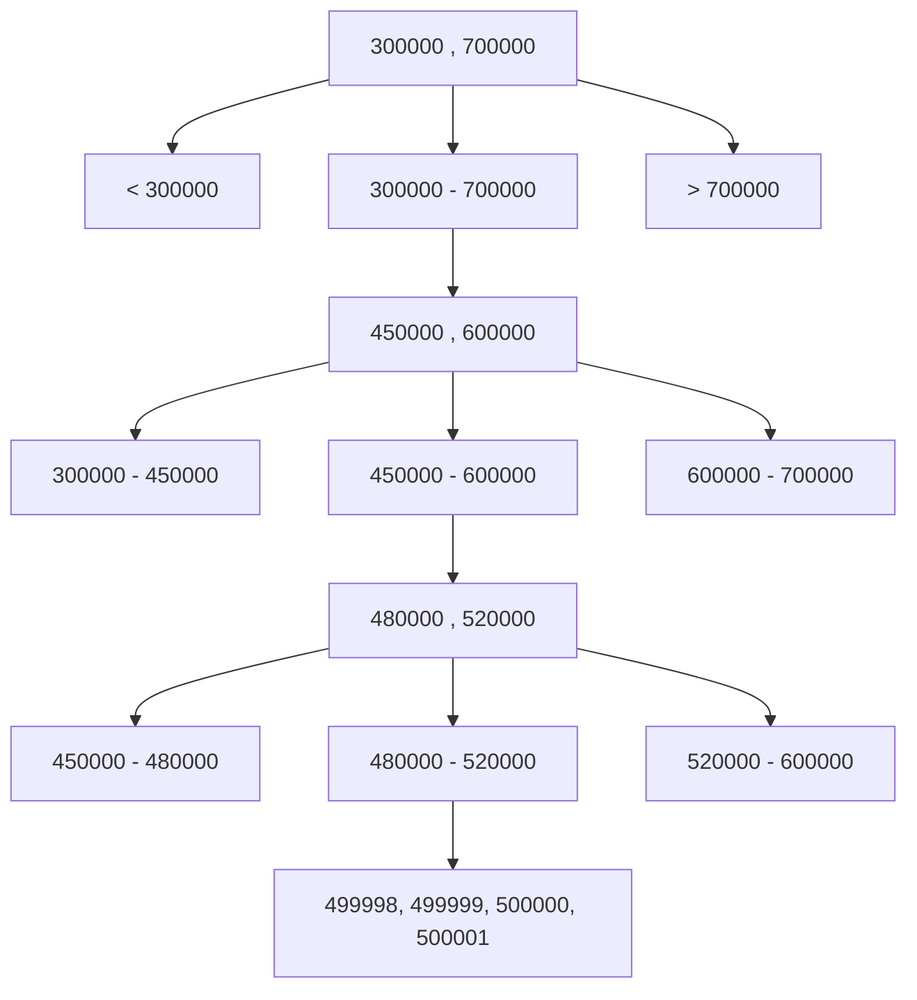

# Module 2
## Part 1
### Part 1, Section 1. From business logit to relational model
In this section we'll learn the following aspects: 
- **a)** set of tables,
- **b)** columns
- **c)** relationships
- **d)** redoundancy
- **e)** security mindset

#### Sub-Section 1.0. What's a relational model 
A relational database stores data into tables. Tables are like Excel sheets, we have columns telling us what kind of info we are dealing with and rows, the observations/items. 

By "relational" we mean that **tables are allowed to reference each other**, and the database can enforce those relationships (e.g. foreign keys).

#### Sub-Section 1.1. Start from the requirements (business logic)
We, as a business, usually need a specific flow to follow in order for us to get the necessay data. A practical example is: <br>
"*People can book a resource for a time range*".

#### Su-Section 1.2. Identifying entities and what they store
Entities are waht become tables. E.g. users, resources, bookings, etc. By identifying what each tables must contain we understand which olumns must be created. 
The columns usually present in any databse, independently from its popruse, answer to the following issues: 
    - Identity
    - Integrity
    - Traceability
    - Safety
    - Security
    - Auditing
    - Mantainability/concurrency safety

- 1. Identity: 
Every row must be uniquely identifiable in a stable way. Otherwise, we cannot safely update rows, safely delte them, reference them from other tables, and we'd have a higher risk of ambiguity. 

e.g.
```sql
id BIGINT UNSIGNED NOT NULL AUTO_INCREMENT PRIMARY KEY
```
Later, we'll actually see how to make ids non-guessable and why they need to be so. The example above here is just for conceptual clearity. 

- 2. Integrity: 
It ensures a databse can't enter an invalid state. Columns and involvedcontraints are: 
    - a) PRIMARY KEY
    - b) FOREIGN KEY
    - c) UNIQUE
    - d) CHECK
    - e) STRICT MODE (behavior enforcement policy, we'll see it later)
Integrity is, in the end, enforced by constraints. 

- 3. Traceability
By using having a **created_at** column, we use a time stmap to know WHEN the row was created, it can thus help use during debugging, fraud investigation, auditing, data life-cycle management, and backfill detection. 

```sql
created_at DATETIME NOT NULL DEFAULT CURRENT_TIMESTAMP
```
We also need to know if any row was ever changed, when it happed, if a bug overwrote data or a script misbehaved. 

```sql
updated_at DATETIME NOT NULL DEFAULT CURRENT_TIMESTAMP
ON UPDATE CURRENT_TIMESTAMP 
```
- 4. Safety (!!important)
Hard deletes are dangerous. If weever delete a user, we could have a booking break. If we ever delete a resource, the historical report become inconsistent.
```sql
DELETE FROM users WHERE id = 5;
```
The row disappears since it is phisically removed from the table. After that: 
```sql
SELECT * FROM users WHERE id = 5;
```
Returns nothing. The database has no memory of it. 

Instead, we mark them as deleted, hence applying what's known as **soft delete**:
```sql
ALTER TABLE users ADD deleted?at DATETIME NULL;
``` 
Instead of: 
```sql
DELETE FROM users WHERE id = 5;
```
We: 
```sql
UPDATE users
SET deleted_at = NOW()
WHERE id = 5;
```
The row still exists but it is logically deleted. 

This is safer but drags an architectural cost. Each query must remember that: 
```sql
WHERE deleted_at IS NULL
```
If we forget ti thandeleted rows might reappear, our app becomes inconsistent, bugs become subtle. 

- 5. Security
We've already seen how to apply an id to eachrow to avoid amiguity. However, it is common (and preferred) practice to have two of them. One private and one public. Many systems have a non guessable public id, either custom with at least 128 bits of randomness or ULID/UUID, and a public one. 
e.g. for public key: 
```sql
public_id CHAR(26) NOT NULL UNIQUE
```
- 6. Auditing 
Auditing procedures often include references telling which user made the change. 
```sql
created_by BIGINT UNSIGNED NULL
updated_by BIGINT UNSIGNED NULL
```
- 7. Mantainability/Concurrency safety

Large systems usually add: 
```sql
version INT NOT NULL DEFAULT 1
```
Used for optimistic locking that prevents two users from overwriting each other's changes silently. We'll see it in a deeper manner later. 

### Part 1, Section 2. Relationships 
By relationship we mean:<br>
"*a formalized rule that links one entity to another in a controlled way*". 

Relationships exist due to multiple information ssystem needs, such as: 
- Ownership (an element belongs to a category)
- Association (a record was create by a user)
- Dependency (a transaction references an account)
- Containment (a file belongs to a folder)
- Classification (a comment references a post)
- Participation (a device reports to a system)

Relational databses do not store "arrows", they store values. 
e.g.
Table A
```bash
id
```
Table B
```bash
id
a_id
```
The relatioship is encoded by: 
```ini
B.a_id = A.id
```
The equality is the entire elational glue.<br>
To further understand relationships we must jum from defining them as: 
"*Row A points to Row B*" <br>
and start defyning them more like: 
"*Row A contains a value that must satisfy a constraint defined in Row B*"

#### Part 1, Sub-section 2.1. Relational Cardinality
##### Sub-section 2.1.1. One-to-One (1:1)
*Each row in A matches at most one row in B*
e.g.
A person has **one** passport, and a device has **one** serial configuration
How do we implement it? Table B contains a **foreign key** to table A which is **UNIQUE**.
```sql
CREATE TABLE A (
    id BIGINT PRIMARY KEY
);
```
```sql
CREATE TABLE B (
    id BIGINT PRIMARY KEY,
    a_id BIGINT UNIQUE,
    FOREIGN KEY (a_id) REFERENCES A(id)
);
```
**UNIQUE** enforces one-to-one

##### Sub-section 2.1.2. One-to-Many (1:N)
One row in table A can be referenced by many rows in table B (very common, if not the most common). Examples that help understanding this could be a category containing many items, a user creating many records, a parent having multiple children. <br>
Only the "**many**" side contains the foreign key: 
```sql
CREATE TABLE A (
    id BIGINT PRIMARY KEY
);

CREATE TABLE B (
    id BIGINT PRIMARY KEY, 
    a_id BIGINT, 
    FOREIGN KEY (a_id) REFERENCES A(id)
);
```
Now many rows in B can point to the same row in A

##### Sub-section 2.1.3. Many-to-Many (M:N)
Many rows in table A can relate to many rows in table B. Examples can include a student enrolling in many courses, a course having multiple students, a product having many tags, a tag belonging to many products. <br>
!! ** Relational databases can't directly represent a matrix M:N** !! To do so, they require an intermediate table: 
```sql
CREATE TABLE A (
    id BIGINT PRIMARY KEY
);

CREATE TABLE B (
    id BIGINT PRIMARY KEY
);

CREATE TABLE A_B (
    a_id BIGINT,
    b_id BIGINT, 
    PRIMARY KEY (a_id, b_id),
    FOREIGN KEY (a_id) REFERENCES A(id),
    FOREIGN KEY (b_id) REFERENCES B(id)
);
```
#### Part 1, Sub-section 2.2. Integrity theory 
Why do FOREIGN KEYs actually matter? Without them: 
- a. The database doen't enforce existence
- b. We could reference non-existing rows
- c. We could create orphan data.

Hence, a foreign key guarantees that "**if B references A, then A MUST exist**."

#### Part 1, Sub-section 2.3. Lifecycle and Referential actions
When two entities are related they become struturslly dependent. <br>
When defining a foreign key: 
```sql
FOREIGN KEY (a_id) REFERENCES A(id)
```
We are saying "B depends on A for existence vallidity". This brings a serious issue, if A changes or disappears, what happens to B? Our system MUST know the answer to this. These are called **referential actions**. They are enforced at database level. 

**Three fundamenta delete policies:** <br>
- 1. RESTRICT (OR NO ACTION) --> "You can't delete A if B references it"n (Strong dependency). 
- 2. CASCADE --> "If A is deleted, delete all dependent B rows automatically" (Weak dependency). 
- 3. SET NULL --> "If A is deleted, then B loses the relationship with it BUT it survives" (Protective dependency). 

To continue, every entity in a relational system has a lifecycle: 
Creation --> Mutation --> Possible deletion --> Historical preservation

The 3 commands form before are important because when entities are related, their lyfecycle intersects. This is known as **lifecycle coupling**. 

### Part 1, Section 3. Normalization
By normalizaion we mean: "don't duplicate the same fact in multiple places". This means that it is ot a formatiing technique, rather a method for ensuring the following: 
- a. Logical consistency,
- b. Minimal redundancy
- c. Structural integrity
- d. Predictable behaviour under updates

It is based on **functional dependency theory**. If we have to use a single sentence, we'd say that a fact should exist in exactly one place. 
## Part 2. Indexing theory

An index is a data structure that allows the database to find rows faster. Without an index, the database performs a full table scan, instead of jumping directly to the relevant row. 

## Part 2, Section 1. The B-tree conceptual model. 
A B-tree is a **balanced** tree structure which nodes' contain **ordered keys** and leaves contain pointers to actual rows. 

Three important properties are: <br>
1. Sorted order
2. Balanced height
3. Logarithmic lookup time

If a tree is balanced the height grows slowly even if the table grows massively. Time complxity becomes O(log n) instead of O(n). 
e.g.
```sql
SELECT * FROM table WHERE id = 500000;
```
Without an index the database would end up scanning 500000 rows. With B-tree index, it has to navigate 3-4 levels. 
```sql
CREATE INDEX idx_id ON table(id);
```

## B-Tree Conceptual Model




